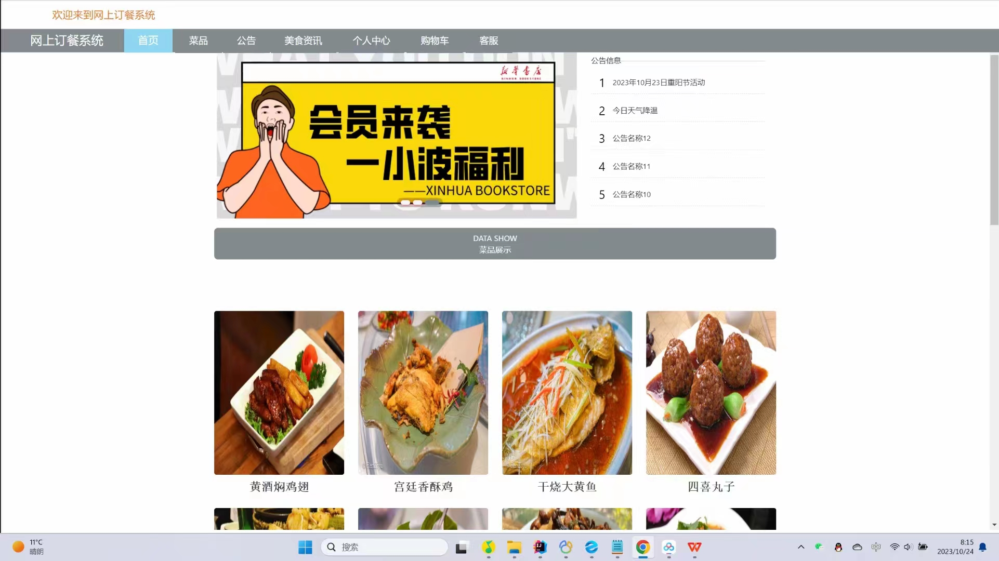
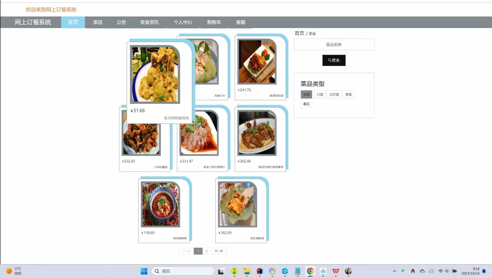
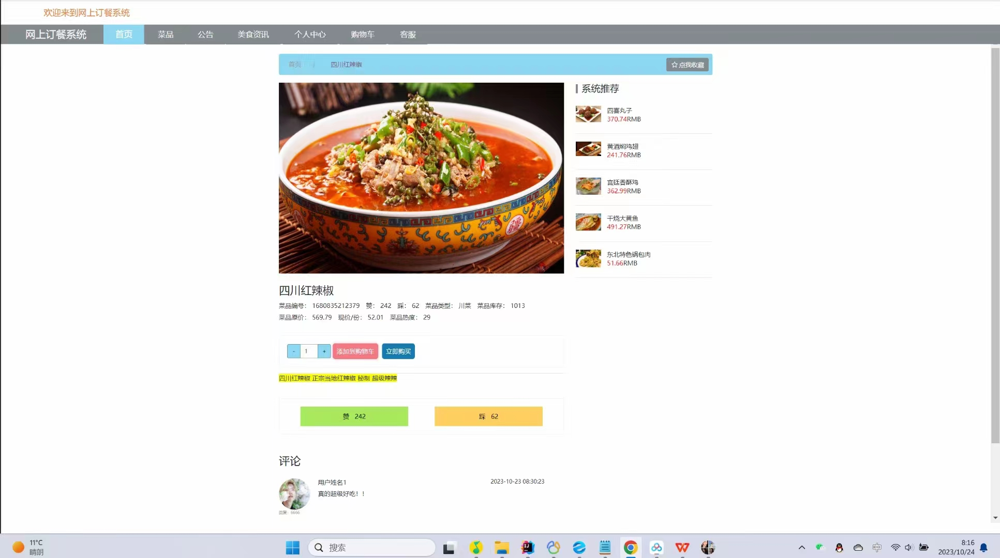
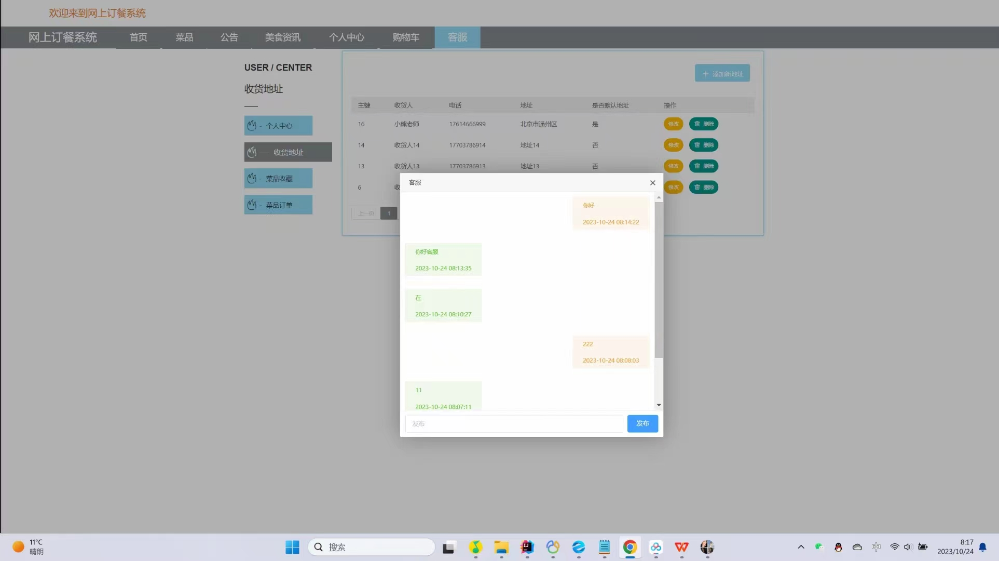
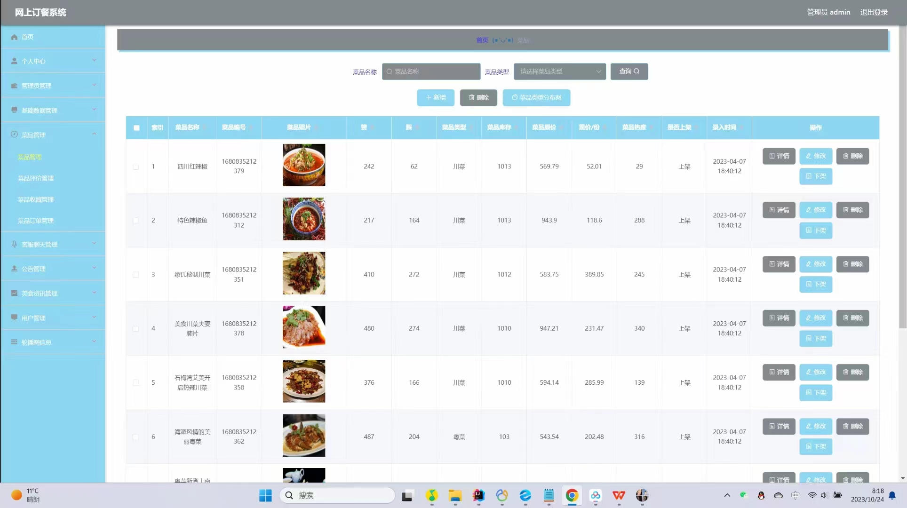
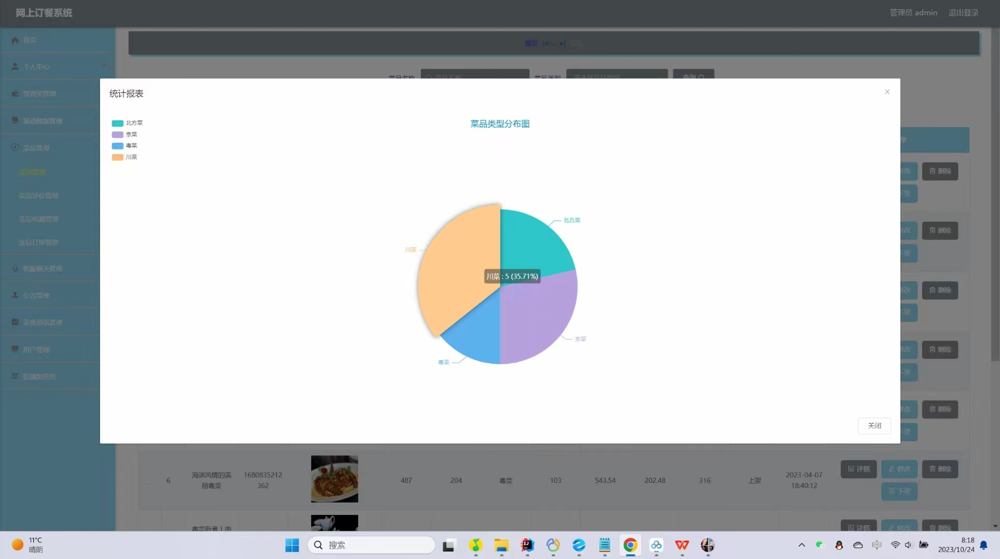

# 基于SSM的网上订餐系统设计与实现

#### 介绍
基于SpringBoot(SSM)的网上订餐系统；
本项目包含：源码+数据库sql+开题报告+论文+说明文档 本项目可以用于毕业设计，白嫖勿扰！
全网毕业设计项目这里都有 更多项目源码可以私信联系：微信 -- 13283346760

#### 主要功能
##### 前台登录：
用户：
①首页、菜品展示、公告信息、美食资讯展示、公告展示、查看更多
②菜品、名称搜索、菜品类型分类、点我收藏、取消收藏、系统推荐、添加购物车、立即购买、点赞、踩、评论
③立即购买、确认收货地址、预约时间、个人余额、确认提交
④公告、美食资讯、个人中心、修改密码、个人信息、点我充值、收货地址、菜品收藏、菜品订单、购物车、客服

##### 后台登录：
管理员：
①个人中心、修改密码、个人信息、管理员管理
②基础数据管理、菜品类型管理、公告类型管理、美食资讯类型管理
③菜品管理、菜品评价管理、菜品收藏管理、菜品订单管理
④客服聊天管理、公告管理、美食资讯管理、用户管理、轮播图管理

#### 软件架构
开发工具： idea
数据库：Mysql 5或8
服务器：Tomcat（版本随意）
后端框架：ssm、mybatis
前端框架：vue、elementui、layui、html

#### 部署教程
1. 创建数据库wangshangdingcan，再运行数据库文件夹里的sql脚本，创建相应表
2. 修改config.properties中与Mysql数据库相关的信息
3. 配置maven依赖，jdk版本
4. 启动项目

#### 运行截图

#### 获取源码
白嫖勿扰！

VX：13283346760

QQ：985089028

